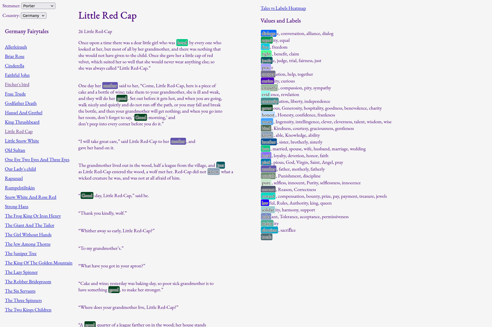
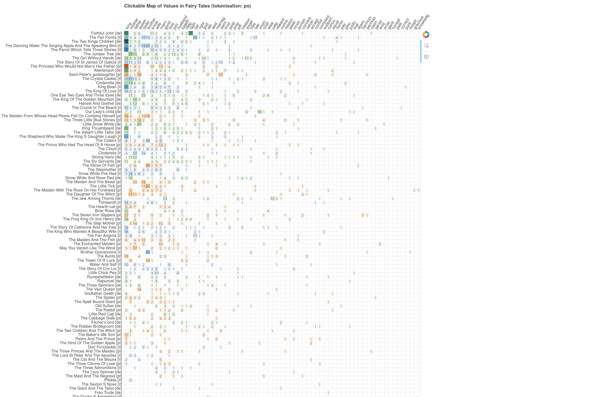
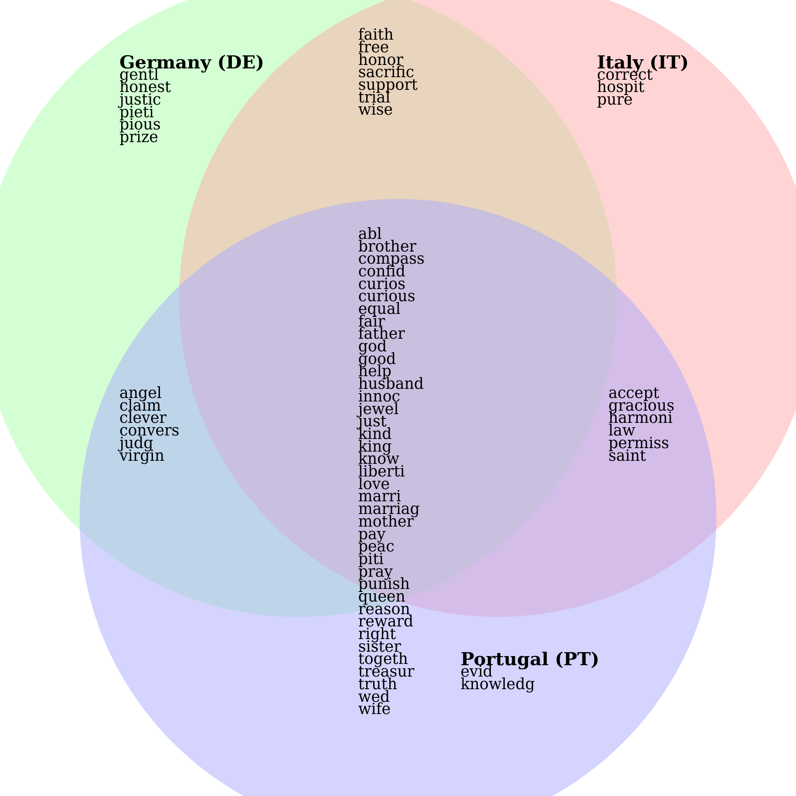
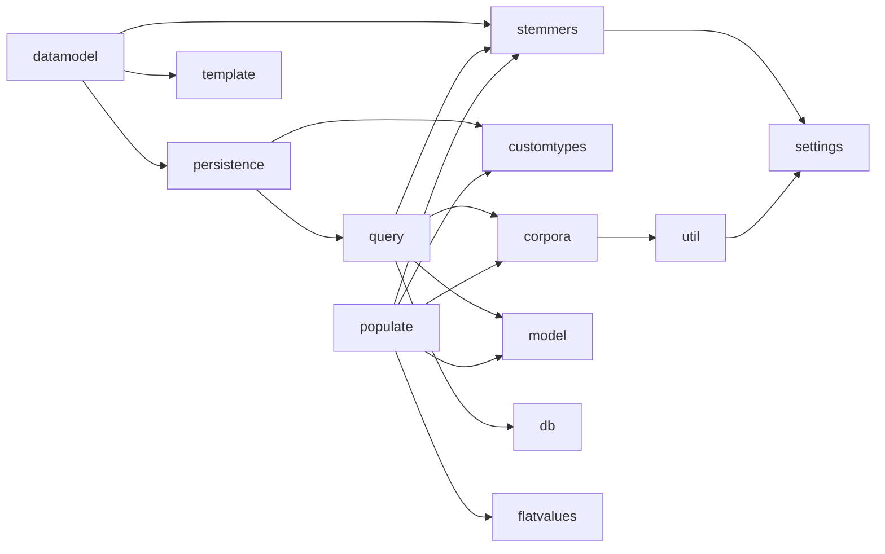

# moreslov - MulticORpus Explorer Systems for Language-modelled Observation and Verification

This is a tool to visually explore (as a case of comparative linguistics) the presence of user-defined sets of textual references in several corpora. It is motivated by the conviction that quantitative analysis (or distant reading if you prefer) can lead to misinterpretations or omissions if not grounded in examples (close reading) from the actual corpora. The risk is somewhat discussed in Franco Moretti's "Falso Movimento", but is just a case of the need to have theory and empiricism go hand in hand.

This is meant to be useful for a set of three small corpora in Old Church Slavonic (tested on 3x~50K word tokens).

* Stemming (actually lemmatisation) is supported as a way to extract more from the small corpora. For currently supported stemmers, see [stemmers.py](stemmers.py).

## Setup

To be able to use this tool, you would need to define:

* sets of words that represent your explicit references (labels representing values). These are defined as CSV files in a file placed in [./vocab](./vocab/) and referenced from [settings.py](settings.py), and

Corpora need to be setup before starting. See the corresponding section below.

This setup uses docker. First step is to put it up. From the root project directory run:
    `docker-compose up --build`  

To initialise the database, use 
    `docker exec -it api /app/populate.py <stemmer>`
or
    `docker exec -it api /app/populate.py --list`
to see all available stemmers for the given language.

### Corpora

Corpora to be studied are located in a directory named `./corpora.*` and referenced from [settings.py](settings.py).

Currently these are fixed to three corpora (see [const.py](const.py), [template.py](template.py)).

Also, clustering requires creation of models and is not integrated in the web interface.

### Values

Due to the original context of this research, we call the sets/clusters of explicit references (societal) values and the words that form these - labels.

Values are defined in a CSV-like file, where each line starts with the value representant, followed by label/keywords (synonyms) separated by commas. An example is provided in [values-edited.txt](values-edited.txt).

## Use
Using [main.py](main.py) a version could be run that generates the analytical pages dynamically on demand. This has slower performance (barely noticeable for a single user).

Implementing caching is recommended in cases of heavier load. Probably best way to implement this is via HTTP headers.

## Screenshots

Currently there are three views: browser, heatmap and Venn diagram.

### Browser preview

The main view is the browser. It features three columns: lists of texts on the left, lists of values on the right and fulltexts in the middle. Navigation to other views and settings are available on the top.

### Clickable heatmap

### Venn diagram 

## Module Dependency Tree

